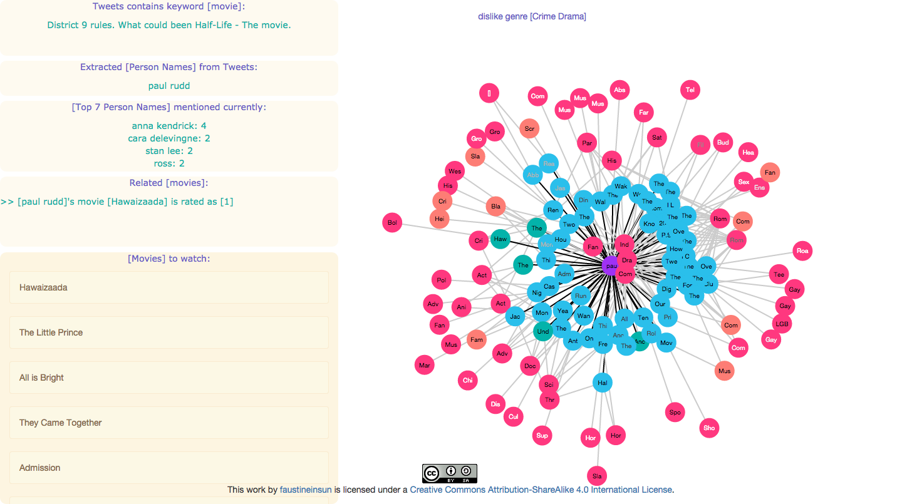
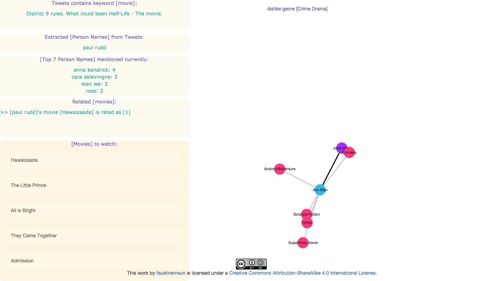
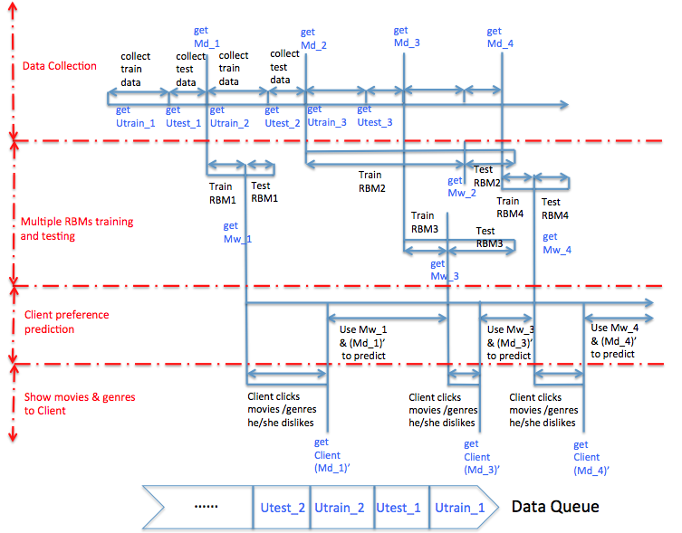
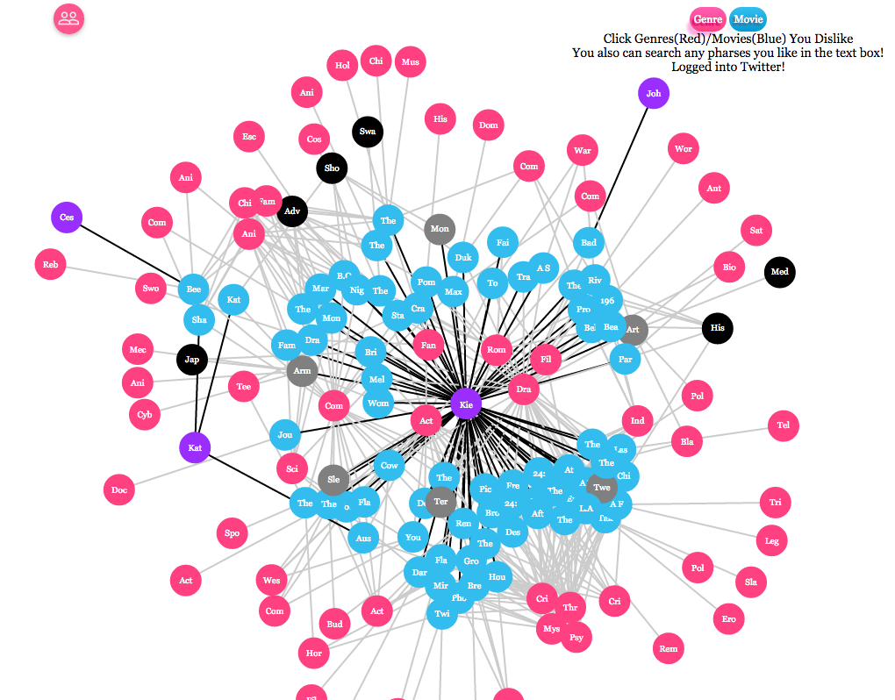
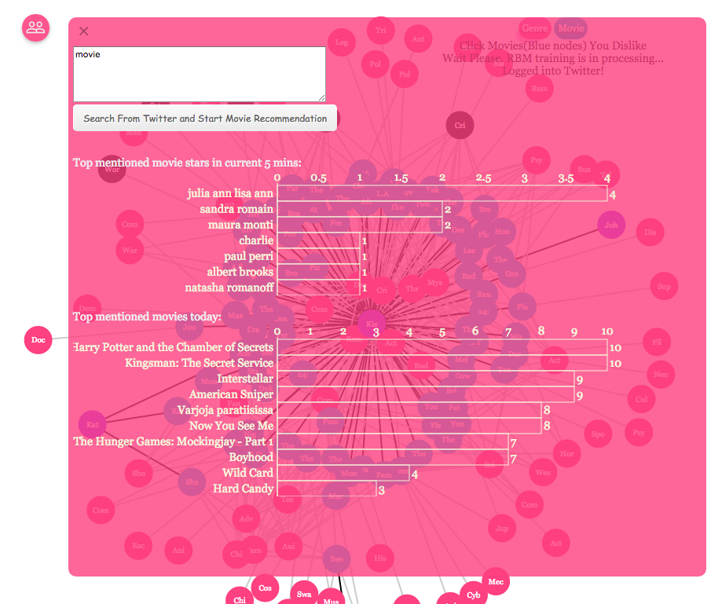

#### Version 2: Node.js + Socket.io
[demo video](https://drive.google.com/file/d/0B-OcoMYLimAlcWdBZHFRRHR5Y2c/view?usp=sharing) (< 1 minute)




#### Version 1: Spring MVC


#### Google Compute Engine (GCE)

```
$ cd WiseCrowdRec
$ sbin/gce-1-installTools.sh
$ sbin/gce-4-stopall.sh

$ screen
$ sbin/gce-3-run-sparkStreaming.sh
ctl+a, d

$ screen -X -S <SCREENID> kill

$ git push -u origin master
```

#### Check List:  
- [x] Streaming processing   
    - [x] [Storm](deprecated-wisecrowdrec-springmvc/WiseCrowdRec/src/main/java/com/feiyu/storm/streamingdatacollection)       
    - [x] [Spark Streaming (Apache Spark 0.9.1)](sparkstreaming-rbm/src/main/java/com/feiyu/spark/SparkTwitterStreaming.java)
- [x] Deep learning  
    - [x] [Restricted Boltzmann Machines (RBM) for Collaborative Filtering](sparkstreaming-rbm/src/main/java/com/feiyu/deeplearning/RBM)        
- [x] Machine learning lib 
    - [x] [Mahout on Hadoop (Collaborative Filtering)](https://github.com/faustineinsun/MahoutHadoopUseCase)           
- [x] [nlp](sparkstreaming-rbm/src/main/java/com/feiyu/nlp)    
    - [x] Stanford CoreNLP    
    - [x] Calais      
- [ ] Multithreaded, Parallel, and Distributed    
    - [x] Multithreading (in Java)    
    - [x] Parallel      
    - [ ] Distributed      
- [x] WebSocket
- [x] [Rabbitmq](https://github.com/faustineinsun/WiseCrowdRec/search?p=1&q=rabbitmq&utf8=%E2%9C%93)        
- [x] [ActiveMQ](deprecated-wisecrowdrec-springmvc/WiseCrowdRec/src/main/java/com/feiyu/storm/streamingdatacollection/stormmsg2websockets)    
- [x] [Apache Camel](deprecated-wisecrowdrec-springmvc/WiseCrowdRec/src/main/resources/SpringApplicationContext.xml) -> from(“file://xxxx").to("activemq://xxxx") (to ActiveMQ's JMS)  
    - $ `netstat -a` -> to check if the activemq process has started    
    - $ `bin/activemq start`   
    - $ `lsof -i:<port>`    
    - $ `kill -9 {PID}`    
    - $ `sudo lsof -i -n -P | grep TCP`  
- [x] [Storm JMS](https://github.com/ptgoetz/storm-jms) -> Java Message Service (JMS)      
- [x] [Freebase](sparkstreaming-rbm/src/main/java/com/feiyu/freebase)   
- [x] Twitter4J
- [x] [Sign in with Twitter](deprecated-wisecrowdrec-springmvc/WiseCrowdRec/src/main/java/com/feiyu/springmvc/controller/TweetsAnalyzerController.java)    
- [x] [nosql - Cassandra](deprecated-wisecrowdrec-springmvc/WiseCrowdRec/src/main/java/com/feiyu/Cassandra)     
- [x] [data search - Elasticsearch](deprecated-wisecrowdrec-springmvc/WiseCrowdRec/src/main/java/com/feiyu/elasticsearch)     
- [x] Hadoop 2.2.0   
- [x] Tomcat 7
- [x] [Spring MVC](deprecated-wisecrowdrec-springmvc/WiseCrowdRec/src/main/java/com/feiyu/springmvc)    
- [x] Amazon EC2
- [x] Google Compute Engine  
- [x] Google Web Toolkit (GWT)  
- [x] [Node.js](nodejs-d3js)
- [x] [Socket.io](sparkstreaming-rbm/src/main/java/com/feiyu/socketio)
- [x] [D3.js Force-Directed Graph](https://github.com/faustineinsun/WiseCrowdRec/blob/master/nodejs-d3js/public/js/scripts.js)    
- [x] Jetty  
- [ ] kafka  
- [ ] Akka  
- [ ] Zookeeper  
- [x] [Scripts for running this project automatically](sbin)
- [x] [Unit Test](deprecated-wisecrowdrec-springmvc/WiseCrowdRec/src/test)  
- [x] [log4j](deprecated-wisecrowdrec-springmvc/WiseCrowdRec/src/main/resources/log4j.properties)    
- [x] [Maven](sparkstreaming-rbm/pom.xml)    
- [x] [WebApp](deprecated-wisecrowdrec-springmvc/WiseCrowdRec/src/main/webapp)    

---
   
- Multithreading Parallel RBM   


- Project Snapshot
     
     
- WiseCrowdRec UI: RealTime Histogram        

