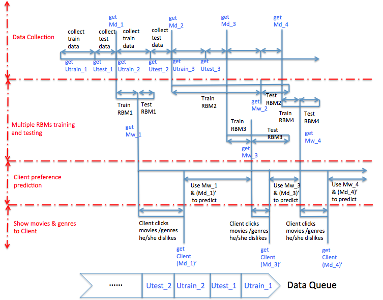
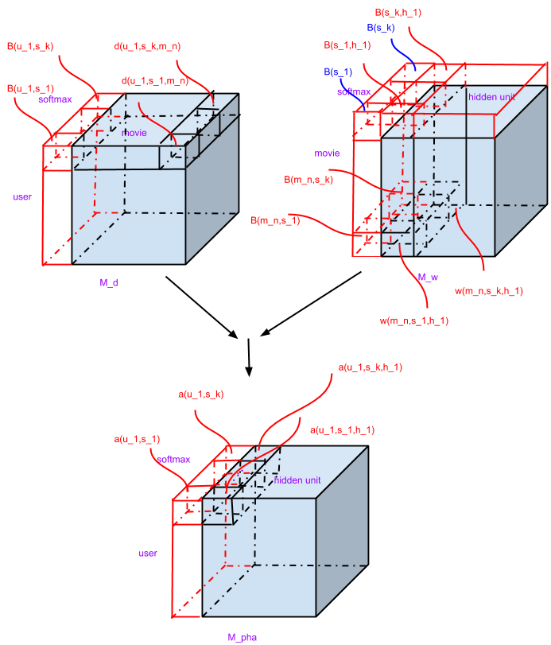
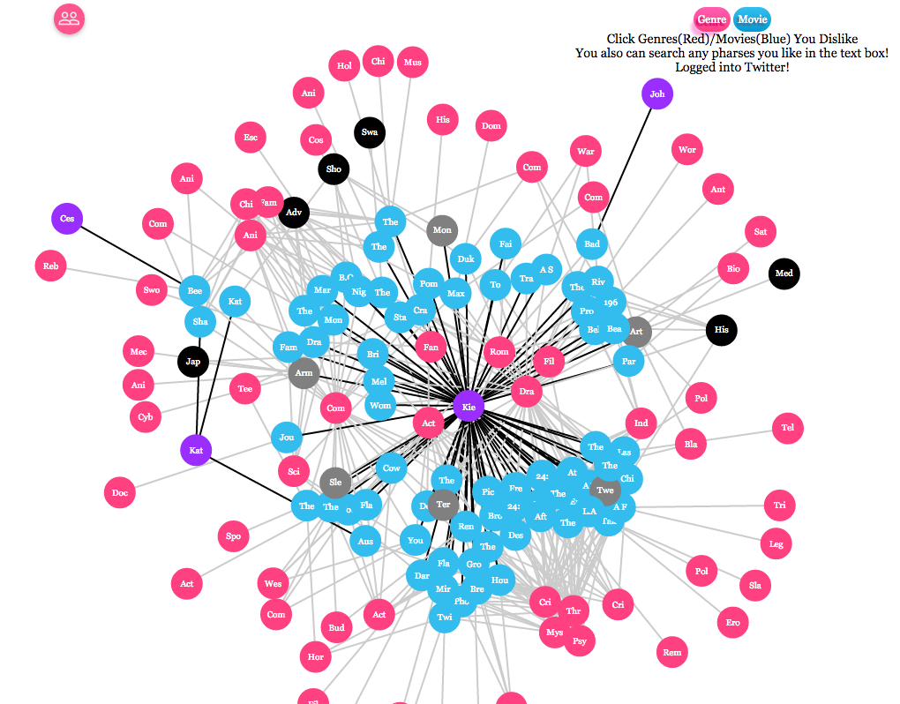
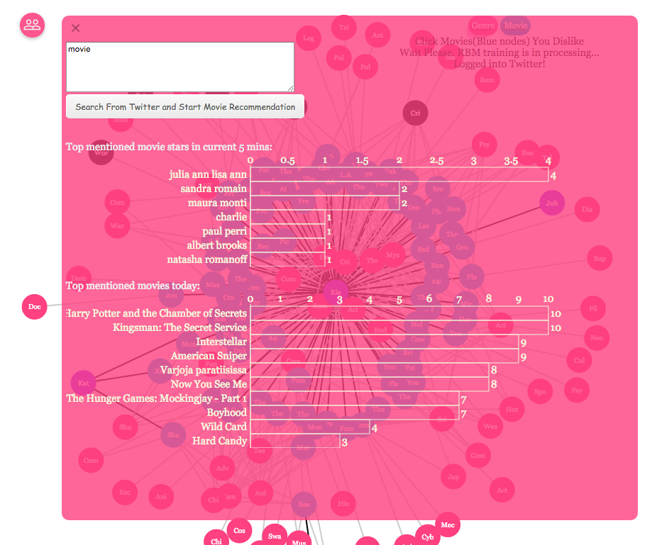

WiseCrowdRec
============


#### Check List:  
- [x] Streaming processing   
    - [x] [Storm](WiseCrowdRec/src/main/java/com/feiyu/storm/streamingdatacollection)       
    - [x] [Spark Streaming (Apache Spark 0.9.1)](WiseCrowdRec/src/main/java/com/feiyu/spark/SparkTwitterStreaming.java)
- [x] Deep learning  
    - [x] [Restricted Boltzmann Machines (RBM) for Collaborative Filtering](WiseCrowdRec/src/main/java/com/feiyu/deeplearning/RBM)        
- [x] Machine learning lib 
    - [x] [Mahout on Hadoop (Collaborative Filtering)](https://github.com/faustineinsun/MahoutHadoopUseCase)           
- [x] [nlp](WiseCrowdRec/src/main/java/com/feiyu/nlp)    
    - [x] Stanford CoreNLP    
    - [x] Calais      
- [ ] Multithreaded, Parallel, and Distributed    
    - [x] Multithreading (in Java)    
    - [x] Parallel      
    - [ ] Distributed      
- [x] WebSocket
- [x] [Rabbitmq](https://github.com/faustineinsun/WiseCrowdRec/search?p=1&q=rabbitmq&utf8=%E2%9C%93)       
- [x] [ActiveMQ](WiseCrowdRec/src/main/java/com/feiyu/storm/streamingdatacollection/stormmsg2websockets)    
- [x] [Apache Camel](WiseCrowdRec/src/main/resources/SpringApplicationContext.xml) -> from(“file://xxxx").to("activemq://xxxx") (to ActiveMQ's JMS)  
    - $ `netstat -a` -> to check if the activemq process has started    
    - $ `bin/activemq start`   
    - $ `lsof -i:<port>`    
    - $ `kill -9 {PID}`    
    - $ `sudo lsof -i -n -P | grep TCP`  
- [x] [Storm JMS](https://github.com/ptgoetz/storm-jms) -> Java Message Service (JMS)      
- [x] [Freebase](WiseCrowdRec/src/main/java/com/feiyu/semanticweb/freebase)    
- [x] Twitter4J
- [x] [Sign in with Twitter](WiseCrowdRec/src/main/java/com/feiyu/springmvc/controller/TweetsAnalyzerController.java)    
- [x] [nosql - Cassandra](WiseCrowdRec/src/main/java/com/feiyu/Cassandra)     
- [x] [data search - Elasticsearch](WiseCrowdRec/src/main/java/com/feiyu/elasticsearch)     
- [x] Hadoop 2.2.0   
- [x] Tomcat 7
- [x] [Spring MVC](WiseCrowdRec/src/main/java/com/feiyu/springmvc)    
- [x] Amazon EC2
- [ ] Google Compute Engine  
- [x] Google Web Toolkit (GWT)  
- [x] [D3.js Force-Directed Graph](WiseCrowdRec/src/main/webapp/resources/js/wisecrowdrec)    
- [x] Jetty  
- [ ] kafka  
- [ ] Akka  
- [ ] Zookeeper  
- [x] [Scripts for running this project automatically](bin)
- [x] [Unit Test](WiseCrowdRec/src/test/java/com/feiyu)  
- [x] [log4j](WiseCrowdRec/src/main/resources/log4j.properties)    
- [x] [Maven](WiseCrowdRec/pom.xml)    
- [x] [WebApp](WiseCrowdRec/src/main/webapp)    

---
   
- Multithreading Parallel RBM   


- RBM for CF With Softmax and Bias   


- Project Snapshot
     
     
- WiseCrowdRec UI: RealTime Histogram        


---

### Setup

#### On Local Machine (Mac OS X)

- $ `vim ~/.bash_profile`    

```
# WiseCrowdRec project home
export WISECROWDREC_HOME=/Users/workspace/WiseCrowdRec/
export PATH=$PATH:$WISECROWDREC_HOME/bin
```

- $ `source ~/.bash_profile`    
- Create the file named `config.properties` in `src/main/resources`  
- Put your [twitter app](https://apps.twitter.com/) OAuth and WiseCrowdRec config info in `config.properties` as follows:   

```
debug=true

#WiseCrowdRec-Local
oauth.consumerKey3=***********
oauth.consumerSecret3=***********
oauth.accessToken3=***********
oauth.accessTokenSecret3=***********

#WiseCrowdRec-EC2
#oauth.consumerKey3=***********
#oauth.consumerSecret3=***********
#oauth.accessToken3=***********
#oauth.accessTokenSecret3=***********

CalaisApiKey=***********
themoviedbApiKey=***********
freebase.api.key=***********
```

- $ `bin/local/1-start-tools-local.sh`
- $ `bin/local/2-deployWCRonTomcat-local.sh`

---

#### On Amazon EC2 (Ubuntu 14.04)

```
$ bin/ec2/1-download-tools-ec2.sh
$ bin/ec2/2-start-tools-ec2.sh
$ bin/ec2/3-deployWCRonTomcat-ec2.sh
```

---

#### Useful info
- [Git](http://www.vogella.com/tutorials/Git/article.html)  
- mvn versions:display-plugin-updates      
- mvn eclipse:clean eclipse:eclipse -Dwtpversion=2.0    
- Eclipse VM: -XX:MaxPermSize=1024M -Xms1024m -Xmx1024m -Dlog4j.debug=true  
- [inspect WebSocket messages](http://www.websocket.org/echo.html)-> ws://0.0.0.0:9292/wcrstorm     
- [Shapeshifter](https://github.com/turn/shapeshifter): Protocol Buffers -> JSON    
- [JSON -> JavaScript](http://www.mkyong.com/javascript/how-to-access-json-object-in-javascript/)  
